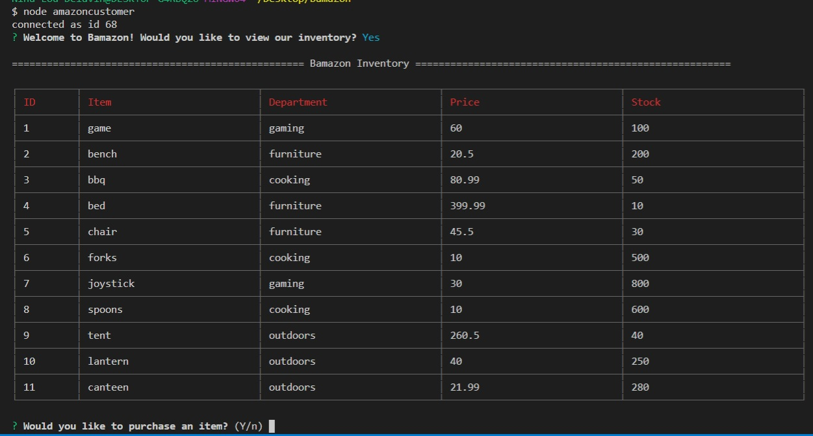
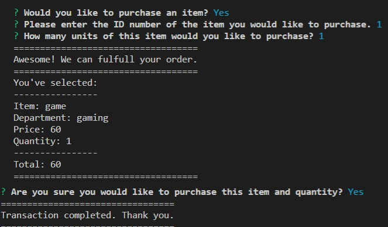
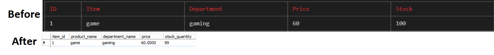

# Bamazon
A amazon-like digital storefront, with console interaction and mysql database - no front-end.

Before the program is run, packages must be installed by typing "npm install <program>"
  
The packages included are:
* [Node.js] (https://nodejs.org/en/)
* [cli-table] (https://www.npmjs.com/package/cli-table)
* [inquirer] (https://www.npmjs.com/package/inquirer)
* [mysql] (https://www.npmjs.com/package/mysql)

After navigating to the root folder of the program, one can run a console command to start the program.
Below are demos of commands and explanations of what they are doing.

*  `node bamazoncustomer.js` starts the program and prompts you if you want to view the inventory
*  `Yes/True` will view the inventory
*  `No/False` will close the program

 
After answering yes to the prompt, a table is made (with cli-table). The table is populated through the database via query. Each row (item) is indexed and pushed onto the table for viewing. After the table is displayed, a new prompt (for purchasing) is enabled.
  
*  `Yes/True` will prompt you for an item id and quantity
*  `No/False` will close the program

*  `(integer)` Will select an item id.
*  `(integer)` will select a quantity

*  `Yes/True` will confirm your purchase, update the database, and restart (TODO: add option to end) the program
*  `No/False` will cancel the confirmation go back to the purchase prompt

After answering yes to the prompt, a new prompt to enter the id and quantity will be enabled. If the user enters an invalid id or quantity, then they will be redirected back to the prompt to try again (TODO: option to exit program at this stage). If the id and quantity is valid, a review of the purchase appears, and a new prompt to confirm the purchase. If the purchase is confirmed, the database is updated, the users purchase is confirmed, and the program ends.
  
  
  
  Below, the updated database is shown.
  

  
Thanks for Reading!
